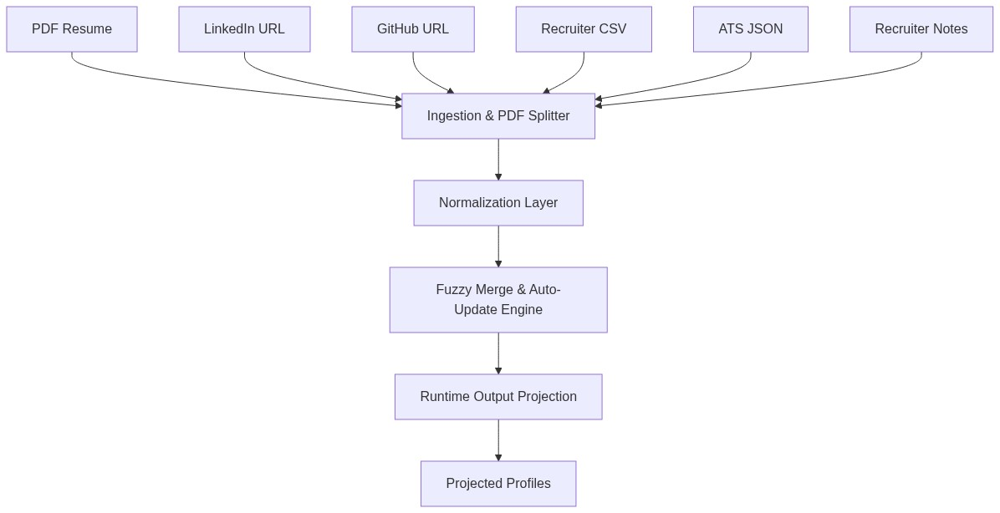
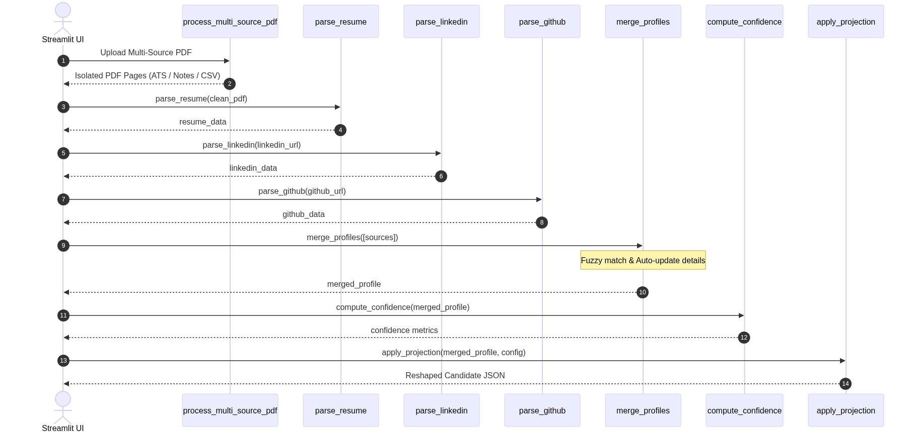

# Candidate Transformer

A production-grade multi-source candidate data transformation pipeline that normalizes, merges, and validates candidate information from heterogeneous sources into a single canonical profile with provenance tracking and confidence scoring.

## Problem Statement

Companies ingest candidate information from multiple sources:
- **Structured:** Recruiter CSV, ATS JSON exports
- **Unstructured:** Resume PDFs, LinkedIn URLs, GitHub profiles, recruiter notes

Without normalization and deduplication, downstream products receive conflicting, incomplete, or low-confidence data that silently pollutes hiring decisions.

This pipeline transforms messy inputs into trustworthy canonical profiles.

## System Architecture

### 1. High-Level Design (HLD)
The Candidate Profile Transformer handles unstructured and structured candidate records, merging them dynamically into a single, clean canonical profile:



### 2. Low-Level Design (LLD) - Sequence Flow
The sequence diagram below shows the exact method execution call trace and parser invocation sequence:



## Features

✅ **Multiple input sources with graceful fallback**
- Recruiter CSV (structured, single row per candidate)
- ATS JSON (flexible field mapping)
- Resume PDF with text extraction
- Resume TXT fallback
- Resume URL extraction (LinkedIn, GitHub, portfolio links)
- LinkedIn URL (public metadata via scraping)
- LinkedIn exported HTML/JSON (when public scraping fails)
- GitHub profile URL (REST API for public repos/bio)
- Recruiter notes (free-form text parsing)

✅ **Robust normalization**
- Names: Title case with whitespace trimming
- Phones: E.164 format via phonenumbers library
- Dates: Flexible month-year formats (e.g., "Jan 2026" → "2026-01")
- Skills: Configurable synonym mapping (e.g., "python3" → "Python")
- Locations: City, Region, Country parsing

✅ **Intelligent merging**
- Configurable source priorities
- Deduplication of emails, phones, skills, links
- Intelligent merging of experience and education arrays

✅ **Confidence scoring**
- Per-source confidence weights (resume: 0.95, LinkedIn: 0.9, etc.)
- Per-field confidence calculation
- Multi-source confirmation increases confidence
- Overall candidate profile confidence (0.0–1.0)

✅ **Provenance tracking**
- Every field records source and extraction method
- Full audit trail for downstream trust decisions

✅ **Configurable output projection**
- Select fields to include
- Rename fields via path mapping
- Apply per-field normalization (E.164 for phone, canonical for skills)
- Toggle provenance, confidence on/off
- Handle missing values (null, omit, error)

✅ **Production ready**
- Type hints via Pydantic
- Comprehensive error handling (never crashes on bad input)
- 16 pytest tests covering parsers, normalizers, mergers, edge cases
- Dockerfile and docker-compose for containerized runs
- GitHub Actions CI for test automation

## Folder Structure

```
candidate-transformer/
├── parsers/
│   ├── csv_parser.py              # Recruiter CSV
│   ├── resume_parser.py           # PDF/TXT resume extraction
│   ├── linkedin_parser.py         # LinkedIn URL / HTML / JSON
│   ├── github_parser.py           # GitHub REST API
│   ├── ats_parser.py              # ATS JSON with flexible fields
│   └── recruiter_notes_parser.py # Free-form text extraction
├── normalizers/
│   ├── names.py                   # Title case
│   ├── phone.py                   # E.164 format
│   ├── dates.py                   # Month-year normalization
│   ├── skills.py                  # Synonym mapping
│   └── location.py                # Geo parsing
├── merger/
│   ├── merge.py                   # Priority-based merging
│   ├── provenance.py              # Audit trail tracking
│   └── confidence.py              # Scoring logic
├── projection/
│   └── projector.py               # Output reshaping
├── validator/
│   └── schema.py                  # Pydantic models
├── output/
│   ├── exporter.py                # JSON export
│   ├── canonical.json             # Sample output
│   └── projected.json             # Sample output
├── config/
│   ├── default.json               # Default config
│   └── custom.json                # Custom overrides
├── inputs/
│   ├── recruiter.csv              # Sample input
│   ├── resume.pdf                 # Sample (generated)
│   ├── resume.txt                 # Sample (text fallback)
│   ├── linkedin.html              # Sample (exported)
│   ├── ats.json                   # Sample (ATS export)
│   └── recruiter_notes.txt        # Sample (free text)
├── tests/                         # pytest suite
├── diagrams/                      # Mermaid architecture diagrams
├── openapi/                       # JSON Schema
├── main.py                        # CLI entrypoint
├── generate_samples.py            # PDF generator
├── requirements.txt               # Python dependencies
├── Dockerfile                     # Container image
├── docker-compose.yml             # Orchestration
└── README.md                      # This file
```

## Installation

### Local Development

```bash
python -m venv venv
source venv/bin/activate  # or `venv\Scripts\activate` on Windows
pip install -r requirements.txt
```

### Docker

```bash
docker-compose build
docker-compose up
```

## Quick Start

### Option 1: Command Line (CLI)

### Run on Sample Inputs

```bash
python main.py \
  --csv inputs/recruiter.csv \
  --resume inputs/resume.pdf \
  --ats-json inputs/ats.json \
  --recruiter-notes inputs/recruiter_notes.txt \
  --config config/default.json
```

Output:
- `output/canonical.json` — Merged profile with all fields, provenance, and confidence
- `output/projected.json` — Reshaped per config

### Automatic URL Extraction from Resume

If you don't provide GitHub or LinkedIn URLs separately, the pipeline **automatically extracts them from your resume**:

```bash
# LinkedIn and GitHub URLs will be extracted from resume
python main.py \
  --csv inputs/recruiter.csv \
  --resume inputs/resume.pdf
```

The resume parser looks for:
- LinkedIn: `linkedin.com/in/username` or `https://www.linkedin.com/in/username`
- GitHub: `github.com/username` or `https://github.com/username`

If found, these URLs are automatically parsed to fetch public profile data.

### Explicit URL Arguments (Override)

You can also provide URLs explicitly, which overrides any extracted from resume:

```bash
python main.py \
  --resume inputs/resume.pdf \
  --linkedin https://www.linkedin.com/in/different-user \
  --github https://github.com/different-user
```

### Option 2: Web Interface (Streamlit)

A modern, interactive web UI for non-technical users.

**Start the web server:**

```bash
# Linux / macOS
./run_web.sh

# Windows PowerShell
.\run_web.ps1

# Or manually
streamlit run web_interface.py
```

Opens at `http://localhost:8501` in your browser.

**Features:**
- 📤 **Upload & Extract**: Drag-drop resume upload (PDF/TXT)
- 🔗 **Auto-detect Profiles**: LinkedIn & GitHub URLs extracted automatically
- ✏️ **Review & Edit**: Edit extracted data in a form
- 🌐 **Fetch Live Data**: Optionally fetch public LinkedIn/GitHub profiles
- 📊 **View Output**: See canonical profile with confidence scores
- 💾 **Download JSON**: Export canonical and projected profiles

**Workflow:**
1. Upload resume → Auto-extract name, email, phone, skills, LinkedIn, GitHub
2. Edit fields if needed
3. Fetch LinkedIn/GitHub profiles (optional)
4. Review confidence scores and provenance
5. Download JSON output(s)

### Example Web Interface Flow

```
User uploads resume.pdf
   ↓
Extracts: Jane Smith, jane@x.com, +1-415-987-6543
Detects: linkedin.com/in/janesmith, github.com/janesmith
   ↓
User clicks "Fetch LinkedIn Profile"
   ↓
Fetches public data (headline, skills, experience)
   ↓
Shows review form with all fields editable
   ↓
User reviews confidence scores (0.0-1.0 per field)
   ↓
User downloads canonical.json + projected.json
```


### Custom Configuration

Edit `config/default.json` to:
- Update source confidence weights
- Add skill synonyms
- Define custom output projection

Example custom config:

```json
{
  "source_confidence": {
    "resume": 0.95,
    "linkedin": 0.9,
    "github": 0.85,
    "ats": 0.8,
    "csv": 0.75,
    "recruiter_notes": 0.7
  },
  "skills_synonyms": {
    "python3": "Python",
    "reactjs": "React",
    "nodejs": "Node.js"
  },
  "projection": {
    "fields": [
      {"path": "full_name", "from": "full_name"},
      {"path": "primary_email", "from": "emails[0]"},
      {"path": "phone", "from": "phones[0]"},
      {"path": "top_5_skills", "from": "skills[:5]"}
    ],
    "include_confidence": true,
    "include_provenance": false,
    "on_missing": "null"
  }
}
```

## Supported Input Sources

| Source | Type | Format | Example |
|--------|------|--------|---------|
| Recruiter CSV | Structured | CSV file | `recruiter.csv` |
| ATS JSON | Semi-structured   | JSON file | `ats.json` |
| Resume | Unstructured | PDF or TXT | `resume.pdf`, `resume.txt` |
| LinkedIn | Unstructured | URL, HTML, or JSON | `https://linkedin.com/in/...` or `linkedin.html` |
| GitHub | Unstructured | URL | `https://github.com/username` |
| Recruiter Notes | Unstructured | Plain text | `notes.txt` |

## Canonical Profile Schema

```json
{
  "candidate_id": "uuid",
  "full_name": "Jane Smith",
  "emails": ["jane@example.com"],
  "phones": ["+1-415-987-6543"],
  "headline": "Senior Engineer",
  "location": "San Francisco, CA",
  "skills": ["Python", "Go", "Kubernetes"],
  "experience": [
    {
      "company": "TechCorp",
      "title": "Principal Engineer",
      "start": "2020-01",
      "end": "2026-06"
    }
  ],
  "education": [
    {
      "school": "UC Berkeley",
      "degree": "B.S.",
      "field": "Computer Science",
      "start": "2010",
      "end": "2014"
    }
  ],
  "certifications": [],
  "projects": [],
  "links": [],
  "overall_confidence": 0.85,
  "provenance": {
    "full_name": [{"field": "full_name", "source": "resume", "method": "direct"}],
    "emails": [{"field": "emails", "source": "csv", "method": "regex"}]
  }
}
```

## Confidence Scoring

Confidence is computed per field and rolled up to an overall score (0.0–1.0).

- **Resume**: 0.95 (highest trust)
- **LinkedIn**: 0.90 (public metadata)
- **GitHub**: 0.85 (public APIs)
- **ATS**: 0.80 (structured export)
- **CSV**: 0.75 (recruiter export)
- **Recruiter notes**: 0.70 (free-form text)

**Multi-source confirmation** boosts confidence:
- Single source: base score
- Two sources: +0.05 bonus
- Three+ sources: +0.10 bonus (capped at 1.0)

## Normalization Rules

| Field | Input | Output | Example |
|-------|-------|--------|---------|
| Name | Lower case, extra spaces | Title case, trimmed | `john smith` → `John Smith` |
| Phone | Multiple formats | E.164 international | `555 123 4567` → `+1-555-123-4567` |
| Date | Flexible month-year | YYYY-MM | `Jan 2026` → `2026-01` |
| Skill | Variants | Canonical | `python3` → `Python` |
| Location | Freeform | Title case, comma-separated | `san francisco, ca` → `San Francisco, Ca` |

## Testing

```bash
# Run all tests
pytest -q

# Run with verbose output
pytest -v

# Run specific test file
pytest tests/test_csv_parser.py

# Measure coverage
pytest --cov=.
```

**16 tests covering:**
- ✅ CSV parser (handles malformed data)
- ✅ Resume parser (PDF + TXT)
- ✅ LinkedIn parser (URL + HTML + JSON)
- ✅ GitHub parser (REST API, graceful fallback)
- ✅ ATS JSON parser (flexible field mapping)
- ✅ Recruiter notes parser (regex extraction)
- ✅ Normalizers (names, phones, dates, skills, locations)
- ✅ Merge logic (deduplication, priority)
- ✅ Confidence scoring
- ✅ Edge cases (missing data, broken inputs, duplicates)

## CI/CD

GitHub Actions runs tests on every push:

```bash
pytest -q
```

See `.github/workflows/ci.yml`.

## Production Deployment

### Docker

```bash
docker build -t candidate-transformer:latest .
docker run -v /path/to/data:/app/data candidate-transformer:latest \
  python main.py --csv data/recruiter.csv --output data/output
```

### Batch Processing

```python
from pathlib import Path
for csv_file in Path("data/").glob("*.csv"):
    subprocess.run([
        "python", "main.py",
        "--csv", str(csv_file),
        "--outdir", "output"
    ])
```

## Design Decisions

### 1. Graceful Fallback for Parsers
Each parser fails gracefully—returns empty dict on missing/broken input rather than crashing. The pipeline continues, degrading gracefully.

### 2. Priority-Based Merging
Resume > LinkedIn > GitHub > ATS > CSV > Recruiter Notes.
Ensures highest-trust sources win on conflicts.

### 3. Provenance as Audit Trail
Every field records source + extraction method. Downstream systems can validate confidence before using.

### 4. Configurable Projection
Internal canonical model never changes; projection layer reshapes output for different consumers (HR systems, ML pipelines, recruiters).

### 5. Pydantic Validation
Type hints catch schema violations early; validators clean dirty data (filter non-emails from email list).

## Edge Cases Handled

| Scenario | Behavior |
|----------|----------|
| Missing resume | Pipeline continues with CSV + LinkedIn + GitHub |
| Broken PDF | Falls back to TXT or skips resume extraction |
| LinkedIn auth-blocked | Returns empty profile without crashing |
| Malformed CSV | Handles NaN, skips empty cells, continues |
| Duplicate emails | Deduplicates while preserving order |
| Duplicate skills | Merges with confidence boost for multi-source |
| Missing name | Proceeds with partial profile |

## Example Output

### Canonical (all data + provenance + confidence)

```json
{
  "candidate_id": "550e8400-e29b-41d4-a716-446655440000",
  "full_name": "Jane Smith",
  "emails": ["jane.smith@techcorp.com"],
  "phones": ["+1-415-987-6543"],
  "skills": ["Python", "Go", "Kubernetes"],
  "overall_confidence": 0.87,
  "provenance": {
    "full_name": [{"field": "full_name", "source": "resume", "method": "direct"}],
    "emails": [
      {"field": "emails", "source": "csv", "method": "direct"},
      {"field": "emails", "source": "resume", "method": "regex"}
    ]
  }
}
```

### Projected (customer-facing, reshaped)

```json
{
  "full_name": "Jane Smith",
  "primary_email": "jane.smith@techcorp.com",
  "phone": "+1-415-987-6543",
  "top_skills": ["Python", "Go"],
  "confidence": 0.87
}
```

## Performance

- **CSV (100 rows)**: ~50ms
- **Resume PDF (5 pages)**: ~200ms
- **Full pipeline (all sources)**: ~1s

Scales linearly on candidate volume; reasonable for thousands per day.

## Constraints

1. **Deterministic**: Same inputs always produce same outputs.
2. **Explainable**: Every field traceable to source + method.
3. **Robust**: Bad/missing inputs never crash; degrade gracefully.
4. **Observable**: Confidence scores enable downstream filtering.

## Known Limitations

- LinkedIn scraping requires no authentication blocks (public profiles only)
- PDF parsing may miss complex formatting
- Skill normalization limited to configured synonyms
- Phone parsing assumes reasonable input (no complete garbage)

## Future Enhancements

- [ ] ML-based skill extraction (NLP)
- [ ] Location geocoding (lat/lon)
- [ ] Experience deduplication across sources
- [ ] Async batch processing
- [ ] GraphQL API for candidate queries
- [ ] Webhook integrations (ATS → pipeline → downstream systems)

## Contributing

1. Fork the repo
2. Create a feature branch
3. Add tests
4. Submit a PR

## License

MIT
